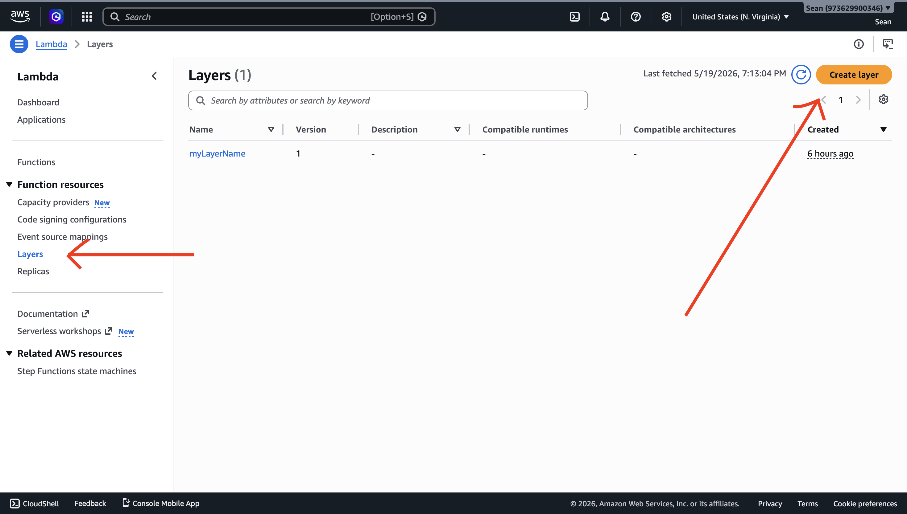
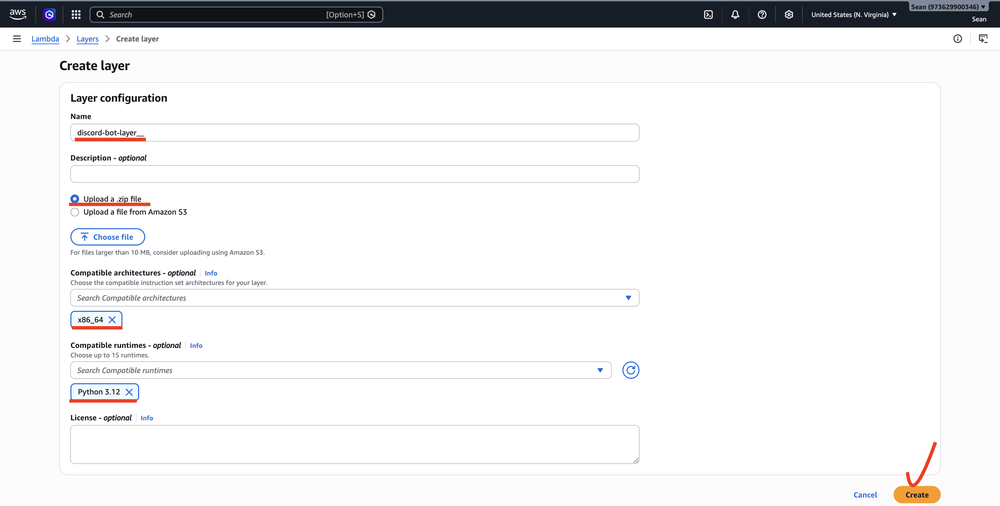
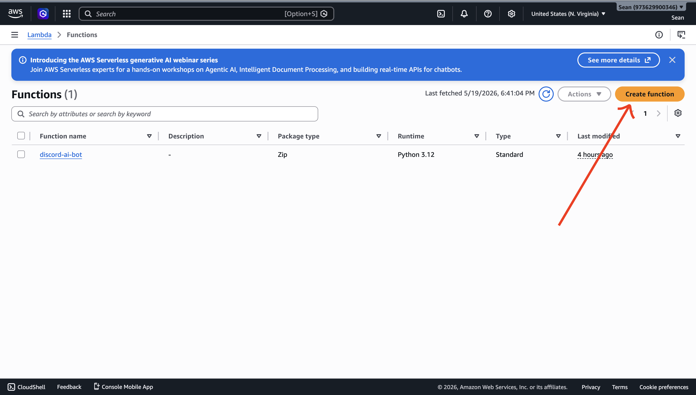
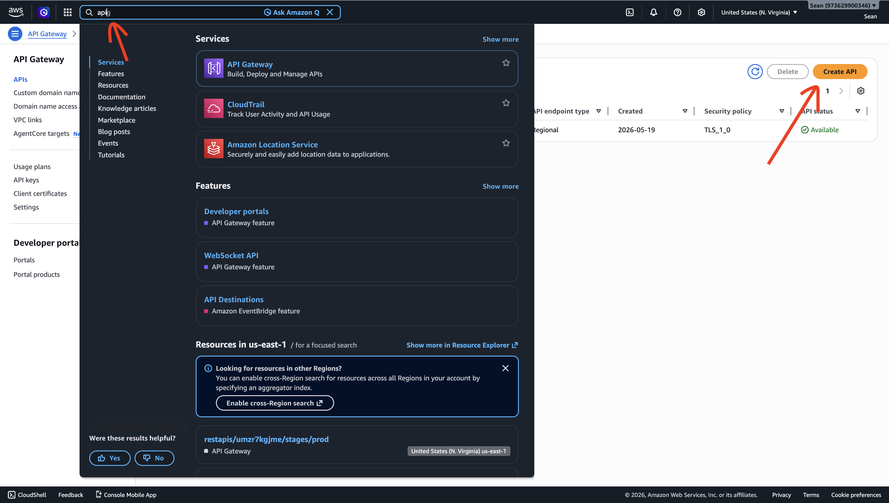
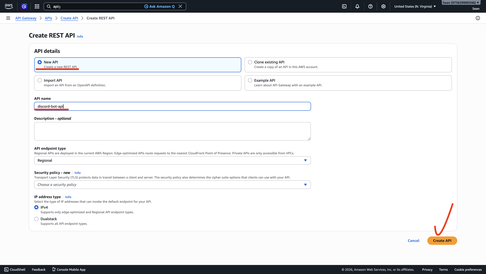

# AWS camp - Discord AI ChatBot

> 結合 Python, AWS Bedrock 與AWS Lambda 架構，在Disocrd 裡和AI 對話！

### 啟動步驟(vscode 的部分)

#### 確認環境
- Python >= 3.10
- AWS 帳號
- Discord 帳號，並已經複製下所有key

#### 步驟0. 下載Git
<https://git-scm.com/install/windows>

#### 步驟1. 建立python 虛擬環境＆安裝套件

```bash 
git clone https://github.com/114-2-aws-chatbot/final
cd final （進到clone 下來的資料夾）
python -m venv venv

# Power Shell, 下面都用Power Shell!!!
.\venv\Scripts\Activate.ps1
(出現(venv) 在前面就好了喔）

pip install -r requirements.txt
```

#### 步驟2. 複製.env 檔案

建立.env 檔案（這個檔案裡面裝的是你們的key 很重要不能流出去

```bash
cp .env.example ./.env 
```
這個時候會看到lambda_bot 這個資料夾裡面多了.env 檔案

#### 步驟3. 設定環境變數

使用vscode 開啟`.env`，填入：
```
# Discord Bot Token（Developer Portal → Bot → Reset Token）
DISCORD_TOKEN=你的_Discord_Bot_Token
DISCORD_PUBLIC_KEY = 你的_Discord_public_token
DISCORD_APP_ID = 你的_Discord_app_id

# AWS 認證金鑰（IAM → 使用者 → 安全憑證 → 建立存取金鑰）
AWS_ACCESS_KEY_ID=XXX
AWS_SECRET_ACCESS_KEY=XXX
AWS_REGION=us-east-1

# 若使用 AWS Academy 臨時憑證，需額外加這行
# AWS_SESSION_TOKEN=你的_Session_Token

# 選填：切換 Bedrock 模型
# BEDROCK_MODEL_ID=amazon.nova-lite-v1
```

## Token & Key 的獲取方式
### Discord Developer--機器人設置及權限
Discord 不僅是一個社群平台，更是功能強大的應用開發環境。要讓你的機器人（Bot）與 AI（如 Amazon Bedrock）溝通並在伺服器中發話，你需要透過 Discord Developer Portal 為它申請一張「虛擬身分證」。

本章節將引導你完成機器人的註冊、權限配置，並取得關鍵的通訊密碼（Token）。完成後，你的機器人將具備進入伺服器的資格。

### 創建專案
1. 點選右上角的「建立」


<br>
2. 點選「為您的伺服器或社群建立一個機器人」
3. 在彈出視窗填寫機器人名字

### 開啟意圖（Intents）
一開始的機器人是無法接收訊息的，這裡要幫機器人開啟權限，就像賦予感官。

4. 一創好畫面長這樣(在左側概要欄位的機器人)


5. 往下滑，找到「Message Content Intent」，在右邊打開權限。


##### 三大「特權意圖（Intents）」詳細拆解
##### 1. Presence Intents(狀態意圖) : 允許機器人接收伺服器成員的「線上狀態」與「活動資訊」。
##### 2. Server Members Intent（伺服器成員意圖）: 允許機器人隨時掌握伺服器內「完整的成員名單」與「成員變動事件」。
##### 3. Message Content Intent（訊息內容意圖）: 允許機器人讀取文字頻道中每一條訊息的具體文字內容。
<br>

### OAuth2 授權網址配置：定義機器人的通訊範圍
OAuth2 是現代網路服務通行的授權機制，這就像是向客戶端請求給我們研發的機器人一張「限時限區的通行證」，並確保它只能執行我們允許的任務。

6. 在左側概要欄位點選「OAuth2」，往下滑找到「OAuth2 URL 產生器」，這會說明機器人在伺服器中能展現的「基礎身份與互動模式」。勾選「bot」、「appplication commands」。

##### 1. bot（機器人身份）: 告訴 Discord「我需要把一個實體機器人帳號拉進伺服器裡」。
##### 2. application.commands（應用程式指令）： 授權這個應用程式在伺服器中註冊並使用「斜線指令（Slash Commands）」。

7. 若上方步驟有勾選「bot」，同一頁繼續往下滑會看到「機器人權限」，勾選「檢視頻道」、「傳送訊息」、「讀取訊息歷史紀錄」

<br>
### Token & DISCORD_APP_ID & DISCORD_PUBLIC_KEY 獲取

Token 是讓 Discord 准許機器人通行的暗號，做任何動作都需要 Token。有了它，你的程式代碼才能代表這個機器人與 Discord API 連線。
注意！絕對不可以外洩 Token！避免不肖人士操作你的機器人。

8. 左側概要欄位點回「機器人」，點選「重設權杖」。

<br>
9. 點選確定要做、並輸入密碼後，可獲得新權杖。記得複製並貼到上述的.env！

10. 從左側欄概要進入一般資訊，複製應用程式 ID 貼到 .env 的 DISCORD_APP_ID ；複製公開金鑰到 .env 的 DISCORD_PUBLIC_KEY 

<br>

### 安裝與測試
透過產生的連結將機器人拉進你的私人測試伺服器。此時機器人會顯示「離線」，因為它的「大腦」（你的 AWS 程式碼）尚未啟動。

10. 終端機輸入指令```python bot.py```，看到```目前登入身分：你的Bot名稱#1234```就代表成功囉。
11. 把安裝連結貼到瀏覽器，就可以安裝至自己的伺服器了。

12. 複製到瀏覽器會有這個畫面，點「新增至我的應用程式」

但裝是裝進去了，現在還不能跟你聊天。


---

## AWS 通行證申請：獲取 Access Key 讓程式與雲端連線

### 為什麼我們需要這把鑰匙？
在上一份講義中，我們拿到了 Discord 的暗號；現在，我們要幫電腦端的程式申請一組 AWS 通行證——Access Key。這組金鑰就像是你的虛擬身分證，讓你的電腦有權限去呼叫 AWS 的 Bedrock AI 模型。

### 步驟

1. 點右上角自己的帳戶名，並選擇「Security credentials」，這是管理你所有登入工具的地方。


2. 往下滑，點選「Create access keys」


3. 使用案例(Use case)選「Local code」，底下「Confirmation」打勾。
雖然我們的目標是把程式碼放到 AWS Lambda 上運行，但因為我們會先在自己的電腦上測試，仍選擇該項。若部署至 Lambda 上運行就會改用 IAM Role 來存取權限。
4. 描述標籤可不填寫，但填的話可幫助你理解該金鑰用處。直接按建立「Create Access Key」即可。
5. 將存取金鑰(Acess Key)和私密存取金鑰(Secret Key)複製下來，最好連.csv都載下來避免之後忘記。**<font color = "red">關閉此網頁後，你將永遠無法再看到這組 Secret Key。</font>** 

6. 剛剛那頁「Security Credentials」往下滑，可以看到自己現在有創哪些「Acess Key」，但「Secret Key」已經看不到了。


### 如果忘記了Secret Key的補救措施
若是忘記Secret Key那就只好刪掉重創一個(ps.一個使用者(User)最多有兩個存取金鑰)。
1. 在剛剛查看存取金鑰畫面點選動作，然後按刪除。


2. 刪掉後再照上面步驟創個新的。

## 傳統 Bot 
【架構一：傳統 Bot — WebSocket 長連線】

  你的電腦 / EC2
  ┌─────────────────────────────────┐
  │  python bot.py                  │
  │                                 │
  │  Discord Gateway (WebSocket) ◄──┼──── Discord 伺服器
  │  持續監聽所有訊息事件             │
  │                                 │
  │  當收到 @ (或其他事件) 時：       │
  │    ↓ 呼叫 AWS Bedrock           │
  │    ↓ 回傳答案到 Discord          │
  └─────────────────────────────────┘

這是傳統 Bot 的程式碼連結，從 google colab 操作。(若有時間將直接從這裡操作)
  https://colab.research.google.com/drive/1gK9q0VrLNMVHZrjmW2y-Z4DyDvLfn22E?usp=sharing

---

## Lambda Bot
我們主要會運用 Lambda 來完成 Discord Bot，以下是 Lambda Bot 架構
```
【架構二：Lambda Bot — Webhook 事件驅動】

  使用者輸入 /ask
      │
      ▼
  Discord 伺服器
      │  HTTP POST（帶簽名）
      ▼
  API Gateway  ──────────────────────────────────────┐
      │                                              │
      ▼                                              │
  Lambda (Path A)                                    │
  ① 驗證 Discord Ed25519 簽名                        │
  ② 非同步觸發自身（fire-and-forget）                 │
  ③ 立即回 Type 5（< 1 秒）── Discord 顯示「思考中」  │
      │                                              │
      │ Lambda.invoke(Event)                         │
      ▼                                              │
  Lambda (Path B - AI 工作者)                        │
  ④ 呼叫 Amazon Bedrock（5~10 秒）                   │
  ⑤ PATCH Discord Webhook 補發答案 ──────────────────┘
```

## 部署AWS (很複雜很累)
#### 步驟 1：打包 Lambda Layer

`pynacl` 含有編譯過的 C 擴充碼，Lambda 的執行環境是 Amazon Linux，必須使用相容的二進位檔。

**在 PowerShell 終端機執行：**

```bash
cd lambda_bot

# 建立 python/ 目錄（Lambda Layer 的固定結構）
mkdir -p python

# 使用 manylinux2014_x86_64 平台，下載 Linux 相容的版本
pip install pynacl requests pip install pynacl requests -t python/ --platform manylinux2014_x86_64 --python-version 3.12 --only-binary=:all: --upgrade

# 打包成 zip
zip -r discord-layer.zip python/ # Mac 或 Linux
Compress-Archive -Path python\* -DestinationPath discord-layer.zip -Force # PowerShell

# 確認大小（正常約 3~5 MB）
du -sh discord-layer.zip # Mac 或 Linux
[math]::Round((Get-Item discord-layer.zip).Length / 1MB, 2) # Powershell
```

**在 AWS Console 建立 Layer：**

1. 前往 **Lambda → Layers → Create layer**

2. Name：`discord-bot-layer-你的座號`
3. 選擇 `Upload a .zip file`，上傳 `discord-layer.zip` （你剛剛透過終端機壓縮的
4. Compatible runtimes：勾選 `Python 3.12`

5. 點選 **Create**，記下 Layer ARN （另外記下來，我推薦notepad

---

#### 步驟 2：建立 Lambda 函式

1. 前往 **Lambda → Functions → Create function**

2. 選擇 **Author from scratch**
3. 填入：
   - Function name：`discord_ai_bot_自己的座號`
   - Runtime：**Python 3.12**
   - Additional settings → General → 打開Custom excution role → 選擇 DC_BOT_ROLE
4. 點選 **Create function**


**上傳程式碼：**

直接在 Lambda Console 貼上 `lambda_function.py` 的內容

**加入 Layer：**

1. Lambda 函式頁面 → **Layers** → **Add a layer**
2. 選擇 `Custom layers`，選取剛建立的 `discord-bot-layer`
3. 點選 **Add**

**調整超時設定：**

1. **Configuration → General configuration → Edit**
2. Timeout 改為 **1 分 0 秒**（60 秒，AI 工作者需要充足時間呼叫 Bedrock）
3. 點選 **Save**

---
#### 步驟 3：API Gateway 設定

**建立 API：**

1. 前往 **API Gateway （直接用搜尋的因為我也找不到）→ Create API**

2. 選擇 **REST API**（不是 HTTP API），點 **Build**
3. API name：`discord-bot-api`
4. 點選 **Create API**


**建立資源與方法：**

1. Actions → **Create Resource**，Resource Name：`discord`，點 **Create Resource**
2. 選中 `/discord`，Actions → **Create Method** → 選 `POST` → 勾選打勾
3. Integration type：**Lambda Function**
4. 勾選 **Use Lambda Proxy Integration**（重要！Discord Header 才能傳進 Lambda）
5. Lambda Function：填入你的函式名稱 `discord-ai-bot`
6. 點 **Save**，彈窗點 **OK** 授權

**部署 API：**

1. Actions → **Deploy API**
2. Deployment stage：`[New Stage]`，Stage name：`prod`
3. 點 **Deploy**
4. 複製頁面上方的 **Invoke URL**，格式為：
   `https://xxxxxxxxxx.execute-api.us-east-1.amazonaws.com/prod/discord`

---

#### 步驟 4：環境變數

Lambda 函式 → **Configuration → Environment variables → Edit → Add environment variable**

| Key | Value | 說明 |
|-----|-------|------|
| `DISCORD_PUBLIC_KEY` | `abcd1234...`（64 字元） | Developer Portal → General Information → Public Key |
| `DISCORD_APP_ID` | `1234567890` | Developer Portal → General Information → Application ID |
| `DISCORD_TOKEN` | `MTQ4NT...` | Developer Portal → Bot → Token |
| `BEDROCK_MODEL_ID` | `amazon.titan-text-lite-v1` | 選填，可換成其他模型 |
| `AWS_BEDROCK_REGION` | `us-east-1` | 選填，Bedrock 服務所在區域 |

填完後點選 **Save**。

---

#### 步驟 5：連接 Discord Endpoint

1. 回到 Discord Developer Portal → 你的應用程式 → **General Information**
2. 找到 **Interactions Endpoint URL**
3. 填入 API Gateway 的 Invoke URL（步驟 3 複製的那個） 注意！！！這邊的URL 結尾要加上/discord
4. 點選 **Save Changes**

Discord 會立刻送出一個 PING 請求驗證你的 Endpoint 是否正常運作。如果儲存成功，代表：
- ✅ Lambda 有在執行
- ✅ 簽名驗證通過
- ✅ API Gateway → Lambda 路由正確

如果儲存失敗，請檢查：
- Lambda 函式是否有錯誤（CloudWatch Logs）
- API Gateway 是否使用 Lambda Proxy Integration
- `DISCORD_PUBLIC_KEY` 環境變數是否正確

---

#### 步驟 7：註冊斜線指令

Discord 的斜線指令（`/ask`）需要向 Discord API 手動註冊，執行一次即可。

在你的本機（已設定好 `.env` 或環境變數的情況下）：

```bash
cd lambda_bot
pip install requests python-dotenv
python register_command.py
```

成功後輸出：

```
✅ 指令註冊成功！指令 ID：1234567890123456789
   全域指令最多 1 小時後才會出現在 Discord，測試用可改為 Guild 指令（速度較快）。
```

> **全域指令 vs Guild 指令：**
> - 全域指令（`/applications/{id}/commands`）：所有伺服器都能用，但更新最多需等 1 小時
> - Guild 指令（`/applications/{id}/guilds/{guild_id}/commands`）：僅限指定伺服器，更新**立即生效**，開發測試用這個比較快

---

