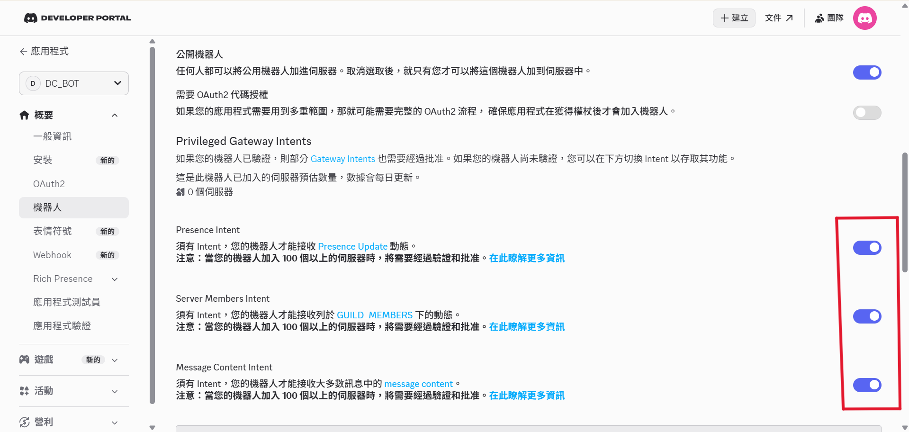
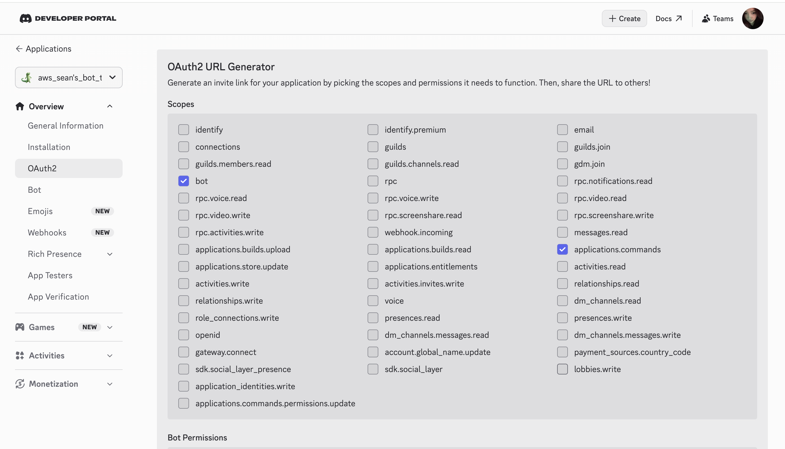
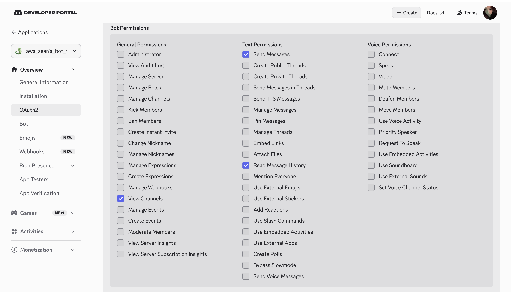
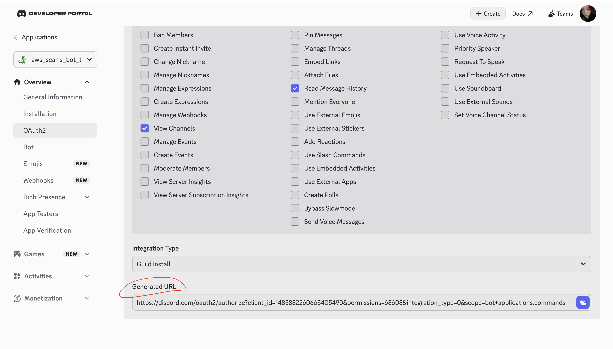
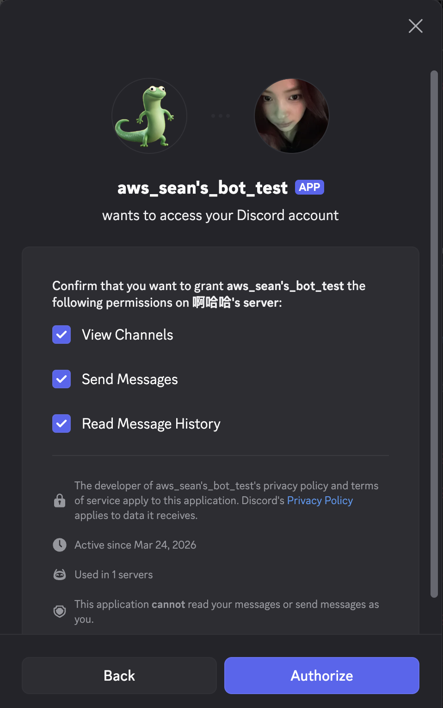
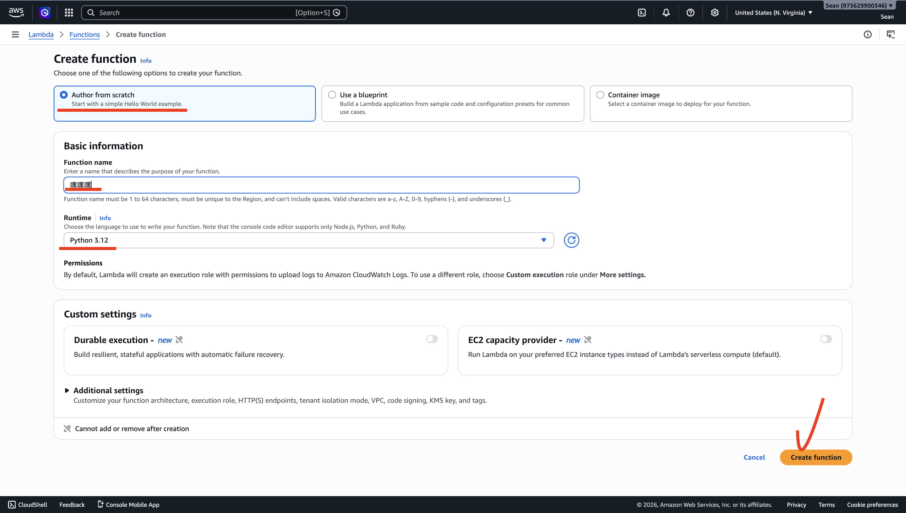

# AWS camp - Discord AI ChatBot

> 結合 Python, AWS Bedrock 與AWS Lambda 架構，在Disocrd 裡和AI 對話！

### 啟動步驟(vscode 的部分)

#### 確認環境
- Python >= 3.10
- AWS 帳號
- Discord 帳號，並已經複製下所有key

#### 步驟1. 建立python 虛擬環境＆安裝套件

```bash 
cd aws_final （進到clone 下來的資料夾）
python -m venv venv

# Power Shell, 下面都用Power Shell!!!
.\venv\Scripts\Activate.ps1
(出現(venv) 在前面就好了喔）

pip install -r requirements.txt
```

#### 步驟2. 複製.env 檔案

建立.env 檔案（這個檔案裡面裝的是你們的key 很重要不能流出去

```bash
cp .env.example ./lambda_bot/.env
```
這個時候會看到lambda_bot 這個資料夾裡面多了.env 檔案

#### 步驟3. 設定環境變數

使用vscode 開啟`.env`，填入：
```
# Discord Bot Token（Developer Portal → Bot → Reset Token）
DISCORD_TOKEN=你的_Discord_Bot_Token

# AWS 認證金鑰（IAM → 使用者 → 安全憑證 → 建立存取金鑰）
AWS_ACCESS_KEY_ID=XXX
AWS_SECRET_ACCESS_KEY=XXX
AWS_REGION=us-east-1

# 若使用 AWS Academy 臨時憑證，需額外加這行
# AWS_SESSION_TOKEN=你的_Session_Token

# 選填：切換 Bedrock 模型
# BEDROCK_MODEL_ID=amazon.nova-lite-v1
```

#### 步驟 4：開啟 Discord Bot 必要設定

前往 [Discord Developer Portal](https://discord.com/developers/applications)：

1. 點選你的應用程式 → **Bot**
2. 往下找到 **Privileged Gateway Intents**
3. 開啟 **Message Content Intent**（沒有這個，Bot 看不到訊息內容）

4. 點選 **Save Changes**

#### 步驟 5：將 Bot 加入伺服器

1. Developer Portal → **OAuth2** → **URL Generator**
2. Scopes 勾選：`bot`

3. Bot Permissions 勾選：`Send Messages`、`Read Message History`、`Embed Links`

4. 複製產生的 URL，在瀏覽器開啟，選擇你的伺服器加入



#### 步驟 6：啟動機器人

```bash
python bot.py
```

看到以下訊息代表成功：

```
目前登入身分：你的Bot名稱#1234
```

### 部署aws (很複雜很累)
---

#### 步驟 1：打包 Lambda Layer

`pynacl` 含有編譯過的 C 擴充碼，Lambda 的執行環境是 Amazon Linux，必須使用相容的二進位檔。

**在 PowerShell 終端機執行：**

```bash
cd lambda_bot

# 建立 python/ 目錄（Lambda Layer 的固定結構）
mkdir -p python

# 使用 manylinux2014_x86_64 平台，下載 Linux 相容的版本
pip install pynacl requests \
    -t python/ \
    --platform manylinux2014_x86_64 \
    --python-version 3.12 \
    --only-binary=:all: \
    --upgrade

# 打包成 zip
zip -r discord-layer.zip python/

# 確認大小（正常約 5~8 MB）
du -sh discord-layer.zip
```

**在 AWS Console 建立 Layer：**

1. 前往 **Lambda → Layers → Create layer**

2. Name：`discord-bot-layer`（自取）
3. 選擇 `Upload a .zip file`，上傳 `discord-layer.zip` （你剛剛透過終端機壓縮的
4. Compatible runtimes：勾選 `Python 3.12`

5. 點選 **Create**，記下 Layer ARN （另外記下來，我推薦notepad

---

#### 步驟 2：建立 Lambda 函式

1. 前往 **Lambda → Functions → Create function**

2. 選擇 **Author from scratch**
3. 填入：
   - Function name：`discord-ai-bot`（自取）
   - Runtime：**Python 3.12**
4. 點選 **Create function**


**上傳程式碼：**

直接在 Lambda Console 貼上 `lambda_function.py` 的內容

**加入 Layer：**

1. Lambda 函式頁面 → **Layers** → **Add a layer**
2. 選擇 `Custom layers`，選取剛建立的 `discord-bot-layer`
3. 點選 **Add**

**調整超時設定：**

1. **Configuration → General configuration → Edit**
2. Timeout 改為 **1 分 0 秒**（60 秒，AI 工作者需要充足時間呼叫 Bedrock）
3. 點選 **Save**

---

#### 步驟 3：IAM 權限設定

Lambda 執行角色預設沒有呼叫 Bedrock 和自己的權限，需要手動新增。

**找到執行角色：**

Lambda 函式 → **Configuration → Permissions → Role name**（點選連結，會跳到 IAM）

**新增內聯政策（Inline Policy）：**

IAM → 該 Role → **Add permissions → Create inline policy** → JSON 模式，貼入：

```json
{
    "Version": "2012-10-17",
    "Statement": [
        {
            "Sid": "BedrockInvoke",
            "Effect": "Allow",
            "Action": [
                "bedrock:InvokeModel"
            ],
            "Resource": "*"
        },
        {
            "Sid": "LambdaSelfInvoke",
            "Effect": "Allow",
            "Action": [
                "lambda:InvokeFunction"
            ],
            "Resource": "arn:aws:lambda:*:*:function:discord-ai-bot"
        }
    ]
}
```

> 將 `discord-ai-bot` 替換成你的 Lambda 函式名稱。

**Policy name** 填入 `discord-bot-policy`，點選 **Create policy**。

---

#### 步驟 4：API Gateway 設定

**建立 API：**

1. 前往 **API Gateway （直接用搜尋的因為我也找不到）→ Create API**

2. 選擇 **REST API**（不是 HTTP API），點 **Build**
3. API name：`discord-bot-api`
4. 點選 **Create API**


**建立資源與方法：**

1. Actions → **Create Resource**，Resource Name：`discord`，點 **Create Resource**
2. 選中 `/discord`，Actions → **Create Method** → 選 `POST` → 勾選打勾
3. Integration type：**Lambda Function**
4. 勾選 **Use Lambda Proxy Integration**（重要！Discord Header 才能傳進 Lambda）
5. Lambda Function：填入你的函式名稱 `discord-ai-bot`
6. 點 **Save**，彈窗點 **OK** 授權

**部署 API：**

1. Actions → **Deploy API**
2. Deployment stage：`[New Stage]`，Stage name：`prod`
3. 點 **Deploy**
4. 複製頁面上方的 **Invoke URL**，格式為：
   `https://xxxxxxxxxx.execute-api.us-east-1.amazonaws.com/prod/discord`

---

#### 步驟 5：環境變數

Lambda 函式 → **Configuration → Environment variables → Edit → Add environment variable**

| Key | Value | 說明 |
|-----|-------|------|
| `DISCORD_PUBLIC_KEY` | `abcd1234...`（64 字元） | Developer Portal → General Information → Public Key |
| `DISCORD_APP_ID` | `1234567890` | Developer Portal → General Information → Application ID |
| `DISCORD_TOKEN` | `MTQ4NT...` | Developer Portal → Bot → Token |
| `BEDROCK_MODEL_ID` | `amazon.titan-text-lite-v1` | 選填，可換成其他模型 |
| `AWS_BEDROCK_REGION` | `us-east-1` | 選填，Bedrock 服務所在區域 |

填完後點選 **Save**。

---

#### 步驟 6：連接 Discord Endpoint

1. 回到 Discord Developer Portal → 你的應用程式 → **General Information**
2. 找到 **Interactions Endpoint URL**
3. 填入 API Gateway 的 Invoke URL（步驟 4 複製的那個） 注意！！！這邊的URL 結尾要加上/discord
4. 點選 **Save Changes**

Discord 會立刻送出一個 PING 請求驗證你的 Endpoint 是否正常運作。如果儲存成功，代表：
- ✅ Lambda 有在執行
- ✅ 簽名驗證通過
- ✅ API Gateway → Lambda 路由正確

如果儲存失敗，請檢查：
- Lambda 函式是否有錯誤（CloudWatch Logs）
- API Gateway 是否使用 Lambda Proxy Integration
- `DISCORD_PUBLIC_KEY` 環境變數是否正確

---

#### 步驟 7：註冊斜線指令

Discord 的斜線指令（`/ask`）需要向 Discord API 手動註冊，執行一次即可。

在你的本機（已設定好 `.env` 或環境變數的情況下）：

```bash
cd lambda_bot
pip install requests python-dotenv
python register_command.py
```

成功後輸出：

```
✅ 指令註冊成功！指令 ID：1234567890123456789
   全域指令最多 1 小時後才會出現在 Discord，測試用可改為 Guild 指令（速度較快）。
```

> **全域指令 vs Guild 指令：**
> - 全域指令（`/applications/{id}/commands`）：所有伺服器都能用，但更新最多需等 1 小時
> - Guild 指令（`/applications/{id}/guilds/{guild_id}/commands`）：僅限指定伺服器，更新**立即生效**，開發測試用這個比較快

---

